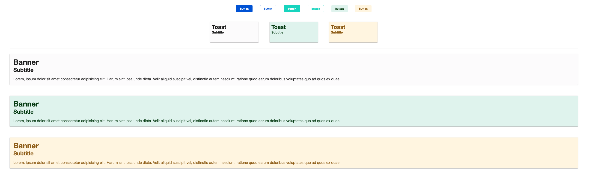

#### TO/DO:

- [ ] Add typography code examples;
- [ ] Add (final) example introducing `css-vars` to improve themeing/white-labeling even further;
- [ ] Add example showcasing usage with `@media` blocks (for responsive, a11y, e.t.c);

---

# Mixin usage

#### _A more reasonable approach to the usage of  SCSS mixins for the development of this toolkit_

`@mixins`, `@extend` directives and `@functions` are really powerful tools offered up to us through SASS/SCSS to keep our design system more maintainable, avoid duplication and minimize overall bundle and final package sizes.

### ***Table of contents***

1. [Mixins](#mixins)
2. [Extend Directive](#extend-directive)
3. [Examples](#examples)
    1. [Default](#default)
    2. [Mixins](#mixins)
    3. [Reorganized](#reorganized)

## **Mixins**

Mixins should be used to *DRY*\* up your code, add clarity, or abstract complexity - in much the same way as well-named functions do in (for example *JavaScript*). Mixins that accept no arguments can be useful for this, but note that if you are not compressing your payload (e.g. gzip), this may contribute to unnecessary code duplication in the resulting styles.

\* - <sub><sup>*Don't Repeat Yourself*</sub></sup>

## **Extend directive**

`@extend` should be minimized because it has unintuitive behavior, especially when used with nested selectors. Instead resort to placeholders (using the notation provided below) if the `@extend` behavior is required to help DRY your code and have a single source of truth.

## Examples

## Default

<details>

<summary>Examples</summary>


```scss
$primary-color: #005CDE;
$accent-color: #03DAC5;
$primary-text-color: #FFFFFF;
$accent-text-color: #005E64;
$default-backdrop-color: #FCFCFC;
$default-text-color: #202020;

$success-color: #E3F5EF;
$success-text-color: #00430B;

$warning-color: #FFF6E3;
$warning-text-color: #996800;

.button {
    background-color: transparent;
    border: 1px solid transparent;
    color: $primary-text-color;
    padding: 4px 8px;
    border-radius: 2px;

    &--success {
        background-color: $success-color;
        color: $success-text-color;
    }

    &--warning {
        background-color: $warning-color;
        color: $warning-text-color;
    }

    &--primary {
        background-color: $primary-color;
        color: $primary-text-color;
        border-color: $primary-color;
    }

    &--inverted {
        border-color: $primary-color;
        color: $primary-color;
    }

    &--accent {
        background-color: $accent-color;
        color: $accent-text-color;
    }

    &--accent-inverted {
        border-color: $accent-color;
        color: $primary-text-color;
    }
}

.toast {
    background-color: $default-backdrop-color;
    color: $default-text-color;
    font-weight: 600;
    box-shadow: 0 1px 1px 0 rgba(0,0,0,.14), 0 2px 1px -1px rgba(0,0,0,.12), 0 1px 3px 0 rgba(0,0,0,.2);

    &--success {
        background-color: $success-color;
        color: $success-text-color;
    }

    &--warning {
        background-color: $warning-color;
        color: $warning-text-color;
    }
}
```

*Outputs*

```css
.button {
  background-color: transparent;
  border: 1px solid transparent;
  color: #FFFFFF;
  padding: 4px 8px;
  border-radius: 2px;
}
.button--success {
  background-color: #E3F5EF;
  color: #00430B;
}
.button--warning {
  background-color: #FFF6E3;
  color: #996800;
}
.button--primary {
  background-color: #005CDE;
  color: #FFFFFF;
  border-color: #005CDE;
}
.button--inverted {
  border-color: #005CDE;
  color: #005CDE;
}
.button--accent {
  background-color: #03DAC5;
  color: #005E64;
}
.button--accent-inverted {
  border-color: #03DAC5;
  color: #03DAC5;
}

.toast {
  background-color: #FCFCFC;
  color: #202020;
  font-weight: 600;
  box-shadow: 0 1px 1px 0 rgba(0,0,0,.14), 0 2px 1px -1px rgba(0,0,0,.12), 0 1px 3px 0 rgba(0,0,0,.2);
}
.toast--success {
  background-color: #E3F5EF;
  color: #00430B;
}
.toast--warning {
  background-color: #FFF6E3;
  color: #996800;
}
```
</details>

## Mixins

<details>

<summary>Examples</summary>


```scss
$primary-color: #005CDE;
$accent-color: #03DAC5;
$primary-text-color: #FFFFFF;
$accent-text-color: #005E64;
$default-backdrop-color: #FCFCFC;
$default-text-color: #202020;
$success-color: #E3F5EF;
$success-text-color: #00430B;
$warning-color: #FFF6E3;
$warning-text-color: #996800;

@mixin states {
    &--success {
        background-color: $success-color;
        color: $success-text-color;
    }

    &--warning {
        background-color: $warning-color;
        color: $warning-text-color;
    }
}

.button {
    background-color: transparent;
    border: 1px solid transparent;
    color: $primary-text-color;
    padding: 4px 8px;
    border-radius: 2px;

    @include states();

    &--primary {
        background-color: $primary-color;
        color: $primary-text-color;
        border-color: $primary-color;
    }

    &--inverted {
        border-color: $primary-color;
        color: $primary-color;
    }

    &--accent {
        background-color: $accent-color;
        color: $accent-text-color;
    }

    &--accent-inverted {
        border-color: $accent-color;
        color: $accent-color;
    }
}

.toast {
    background-color: #FCFCFC;
    color: #202020;
    font-weight: 600;
    box-shadow: 0 1px 1px 0 rgba(0,0,0,.14), 0 2px 1px -1px rgba(0,0,0,.12), 0 1px 3px 0 rgba(0,0,0,.2);
    @include states();
}
```

*Outputs*

```css
.button {
  background-color: transparent;
  border: 1px solid transparent;
  color: #FFFFFF;
  padding: 4px 8px;
  border-radius: 2px;
}
.button--success {
  background-color: #E3F5EF;
  color: #00430B;
}
.button--warning {
  background-color: #FFF6E3;
  color: #996800;
}
.button--primary {
  background-color: #005CDE;
  color: #FFFFFF;
  border-color: #005CDE;
}
.button--inverted {
  border-color: #005CDE;
  color: #005CDE;
}
.button--accent {
  background-color: #03DAC5;
  color: #005E64;
}
.button--accent-inverted {
  border-color: #03DAC5;
  color: #03DAC5;
}

.toast {
  background-color: #FCFCFC;
  color: #202020;
  font-weight: 600;
  box-shadow: 0 1px 1px 0 rgba(0,0,0,.14), 0 2px 1px -1px rgba(0,0,0,.12), 0 1px 3px 0 rgba(0,0,0,.2);
}
.toast--success {
  background-color: #E3F5EF;
  color: #00430B;
}
.toast--warning {
  background-color: #FFF6E3;
  color: #996800;
}
```

</details>

## Reorganized

<details>

<summary>Examples</summary>


```scss
$primary-color: #005CDE;
$accent-color: #03DAC5;
$primary-text-color: #FFFFFF;
$accent-text-color: #005E64;
$default-backdrop-color: #FCFCFC;
$default-text-color: #202020;
$success-color: #E3F5EF;
$success-text-color: #00430B;
$warning-color: #FFF6E3;
$warning-text-color: #996800;

@mixin states {
    &--success {
        background-color: $success-color;
        color: $success-text-color;
    }

    &--warning {
        background-color: $warning-color;
        color: $warning-text-color;
    }
}

@mixin primary-accent-colors() {
    &--primary {
        background-color: $primary-color;
        color: $primary-text-color;
        border-color: $primary-color;
    }

    &--inverted {
        border-color: $primary-color;
        color: $primary-color;
    }

    &--accent {
        background-color: $accent-color;
        color: $primary-text-color;
    }

    &--accent-inverted {
        border-color: $accent-color;
        color: $accent-color;
    }
}

.button {
    background-color: transparent;
    border: 1px solid transparent;
    color: $primary-text-color;
    border-radius: 2px;

    @include states();
    @include primary-accent-colors();
}

.toast,
.banner {
    background-color: #FCFCFC;
    color: #202020;
    font-weight: 600;
    box-shadow: 0 1px 1px 0 rgba(0,0,0,.14), 0 2px 1px -1px rgba(0,0,0,.12), 0 1px 3px 0 rgba(0,0,0,.2);
    @include states();
}

.banner {
  width: 100%;
  height: 48px;
}
```

</details>

---



---

## Typography

<details>
<summary>Examples</summary>

```scss
$base-font-size: 16px; // Default font-size
$default-font-family: Roboto, "Helvetica Neue", Arial,Helvetica, sans-serif;
$default-font-weight: 400;

@function em($pixels, $context: $base-font-size) {
  @if (unitless($pixels)) {
    $pixels: $pixels * 1px;
  }
  @if (unitless($context)) {
    $context: $context * 1px;
  }

  @return $pixels / $context * 1rem;
}

// ...

body {
  font-family: $default-font-family;
  font-size: $base-font-size;
  font-weight: $default-font-weight;
}

h1,
h2
h3,
h4,
h5,
h6 {
  font-weight: 500;
}

h1 {
  font-size: toRem(24px);
}
h2 {
  font-size: toRem(22px);
}
h3 {
  font-size: toRem(20px);
}
h4 {
  font-size: toRem(18px);
}
h5 {
  font-size: toRem(15px);
}
h6 {
  font-size: toRem(13px);
}
p {
  font-size: toRem(15px);
}
label {
  font-size: toRem(15px);
  font-weight: 500;
}
```
</details>

#### _You might have noticed that although all the `CSS` outputs are the exact same, but most certainly their source (`SCSS`) are a far cry when it comes to:_

- Bug location & fixing;
- Makes it much easier to maintain/add/change typography styles;
- Making it easier to add new color schemes;
- Keeping the code equally searchable;
- Making it easier to compose and resuse small bits of code;
- Reducing the size of our design system bundle;
- Reducing the size of the final css output bundle size;
